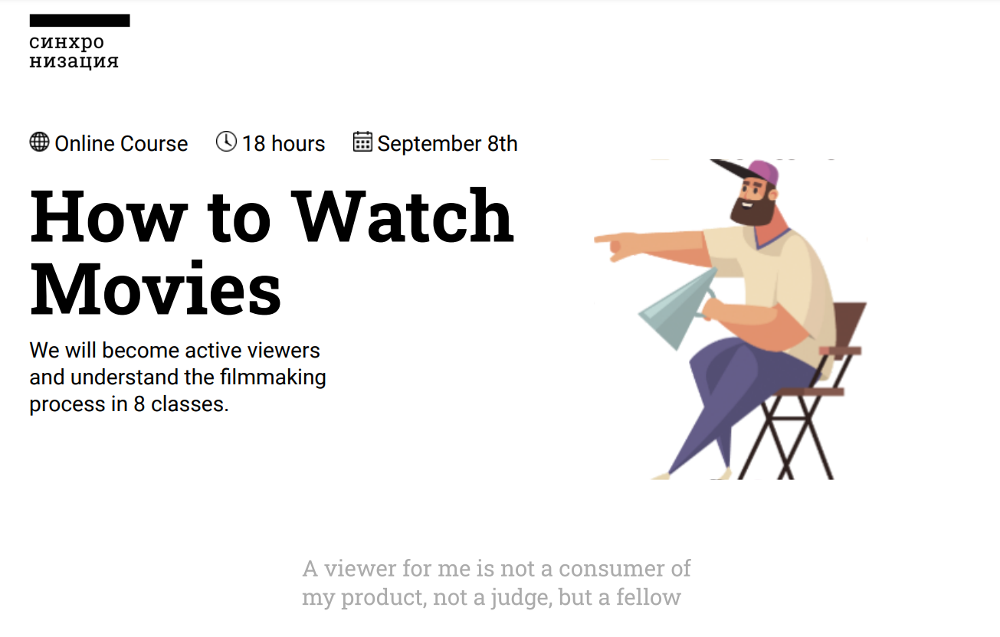

Responsive Course Webpage

> course-page

 ## [Demo](https://nikofx.github.io/CoursePage/)

## Tools

## Meta

 Nijat Gurbanov

- Github: [github.com/NikoFX](https://github.com/NikoFX)
- Twitter: [Nijat Gurbanov](https://twitter.com/)
- Linkedin: [linkedin.com/in/nijat-gurbanov-dev](https://www.linkedin.com/in/nijat-gurbanov-dev/)

## Contributing

1. Fork it (<https://github.com/NikoFX/react-pizza-app/fork>)
2. Create your feature branch (`git checkout -b feature/fooBar`)
3. Commit your changes (`git commit -am 'Add some fooBar'`)
4. Push to the branch (`git push origin feature/fooBar`)
5. Create a new Pull Request

<!-- Markdown link & img dfn's -->
[npm-image]: https://img.shields.io/npm/v/datadog-metrics.svg?style=flat-square
[npm-url]: https://npmjs.org/package/datadog-metrics
[npm-downloads]: https://img.shields.io/npm/dm/datadog-metrics.svg?style=flat-square
[travis-image]: https://img.shields.io/travis/dbader/node-datadog-metrics/master.svg?style=flat-square
[travis-url]: https://travis-ci.org/dbader/node-datadog-metrics
[wiki]: https://github.com/yourname/yourproject/wiki
